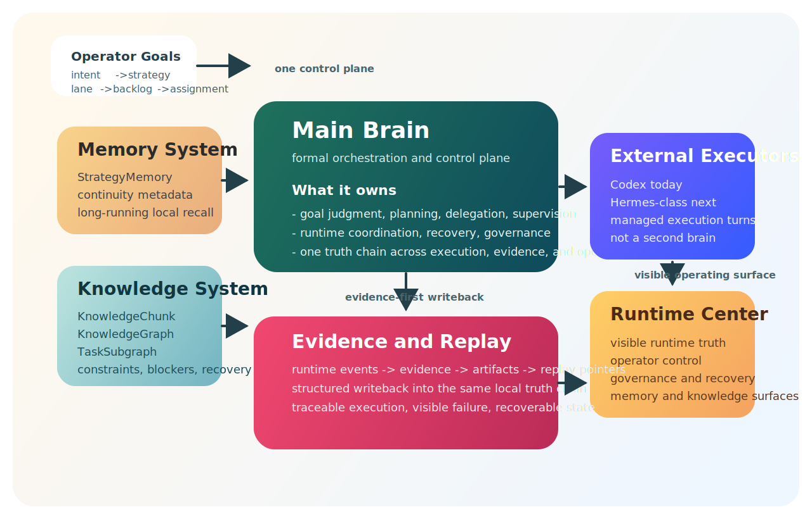

<div align="center">
  

  # superSpider

  <p><b>面向本地长期自治执行的主脑系统。</b></p>
</div>

superSpider 不是另一个聊天壳子。它是一套面向本地自治执行的主脑系统，用来通过受管外部执行体、可见运行态、持续环境和证据优先回写，驱动长期任务持续推进。

当前正式外部执行体路径是 `Codex`。这套架构后续会继续扩展到更多外部执行体，包括 `Hermes` 这一类 runtime，但不会把这些执行体变成第二个主脑，也不会让它们拥有第二套系统真相。

## 系统总览

<p align="center">
  
</p>

这张图表达的是这套系统最重要的边界：只有一个控制面、只有一条真相链、只有一个可见操作面。主脑负责长期任务治理，记忆和知识负责稳定长期上下文，外部执行体负责执行，证据与回放负责让整条链可追踪、可核对、可恢复。

## 为什么会有这个项目

大多数 AI 项目停留在聊天、提示词和工具调用这一层。那一层当然有用，但一旦任务需要持续运行、恢复、追责、核对证据，或者在模型回复之后继续推进，单纯聊天就不够了。

superSpider 想解决的是更难的那一层：

- 只有一个主脑，负责判断下一步该做什么
- 只有一条记忆和知识链，负责让系统在长期运行中不丢失上下文和约束
- 只有一个 Runtime Center，负责把运行态、证据、恢复和人工控制放到同一个可见面
- 通过受管外部执行体真正干活，但不让执行体取代主脑

## superSpider 的核心优势

superSpider 的核心优势，不是“会聊天”，而是“能持续执行并且可被治理”。

- 规划、派发、监督、恢复属于主脑，不散落到 prompt 和临时脚本里
- 记忆和知识属于正式本地真相链，不依赖一次性上下文窗口
- 执行属于受管外部执行体，不把规划和执行混成一个黑箱
- 证据、回放、产物、操作员可见性都回到同一条回写链

这套边界的价值在于：执行层可以演进，但控制面不会丢；模型可以变化，但系统真相不会散；任务可以长期运行，但操作员始终看得见、管得住、接得回来。

## 核心系统能力

### 主脑

superSpider 有正式的主脑编排层，而不是聊天优先的请求循环。

- 它会把目标、backlog、assignment 和运行上下文编译成执行动作
- 它负责决定什么应该立刻做，什么应该等待，什么应该委派，什么需要恢复或人工确认
- 它让系统跨长链任务保持一致，而不是把每一轮都当成一段孤立对话

### 记忆系统

这套系统不是只有聊天记录，它有正式记忆。

- `StrategyMemory` 承载使命、优先级、约束、执行策略和证据要求
- 运行连续性通过 `work context`、`assignment`、`executor thread binding` 和持久元数据保持
- 这是一条本地、truth-first 的长期记忆链，目标是支撑执行连续性，而不是单纯把 prompt 变长

### 知识系统

superSpider 把知识和记忆分开，并且给知识结构化载体。

- `KnowledgeChunk` 负责在全局、行业、agent、task、work context 等作用域里保存长期事实
- 系统可以为当前查询或当前任务激活结构化知识图谱和任务子图
- 这些子图里可以携带实体、约束、矛盾、依赖、阻塞、恢复路径和证据引用
- 规划器和 Runtime Center 可以直接消费这些结构化知识，而不是只靠临时拼接 prompt

### 证据与回放

superSpider 的目标不是“回答得像做过了”，而是“真的做过并且留得下证据”。

- 外部动作和执行 turn 会回写成 runtime event、evidence、artifact 和 replay pointer
- 系统能够说明做了什么、改了什么、失败在哪里、为什么做出某个判断
- 这让它适合真实运行链，而不是只适合 demo

### Runtime Center

Runtime Center 不是附带页面，而是这套系统的正式操作面。

- 它把运行态、证据、治理、恢复、记忆激活和操作员控制集中起来
- 它让操作员看到系统当前认为“什么是真的”
- 它让长期执行保持可见，而不是埋进 worker、日志和零散脚本里

### 外部执行体

superSpider 不把执行当成 prompt 技巧，而是把执行当成受管执行面。

- `superSpider` 负责主脑逻辑、真相链、恢复逻辑和可见控制面
- 外部执行体负责实际 execution turn
- 执行结果通过规范化 runtime event、evidence 和结构化 writeback 回流
- 当前正式路径是 `Codex`
- 后续路径包括 `Hermes` 这一类 runtime，以及其他能满足同一执行合同的正式 executor provider

## 适合什么应用

superSpider 适合的不是“一次性问答”，而是更长链、更真实的执行场景：

- 本地长期研究、运营和推进循环
- 需要记忆、知识、证据和恢复共同配合的任务系统
- 要求运行态持续可见、可治理、可人工接管的自动化系统
- 跨浏览器、桌面、文档、文件或外部 runtime 的执行链，但仍然只想保留一个控制面

## 当前已经落地什么

当前仓库已经具备这些核心能力：

- 围绕目标、backlog、assignment、runtime state 和 evidence 的正式主脑执行链
- 正式战略记忆和长期本地记忆读链，可服务运行时和规划读面
- 基于 `KnowledgeChunk`、知识子图激活和 Runtime Center 知识投影的结构化知识路径
- 基于 `Codex` 的受管本地外部执行体路径
- runtime continuity、事件摄取、证据回写和恢复链
- 一个可用于执行、观察、治理、记忆表面和操作员控制的 Runtime Center
- 本地优先的运行方式，让操作员能看到系统做了什么、失败在哪里、当前真相是什么

## 为什么开发者应该关心

superSpider 面向的不是只想聊天的人，而是想做真正执行系统的人：

- 想做 AI agent / automation，但不想接受黑箱运行时的开发者
- 想要本地自治执行，而不是依赖托管编排层的独立开发者
- 把记忆、知识结构、证据链和恢复能力当成一等公民的系统构建者

## 这个项目不是什么

superSpider 不是：

- 通用聊天 UI
- 套着工具调用的 prompt 外壳
- 随意拼接能力的工作流市场
- 把任意导入项目都当成正式执行体的容器

这个仓库想做的是一套有纪律的执行架构，而不是一堆 demo 的拼盘。

## 仓库结构

- `src/copaw/`：运行内核、状态、能力、执行、证据和兼容层
- `console/`：主前端和 Runtime Center
- `website/`：仓库内文档和对外页面
- 根目录规划与状态文档：记录架构、迁移和验收进度

## 命名说明

- 项目名：`superSpider`
- 仓库地址：`https://github.com/15680676726/superSpider`
- 当前 Python 包 / CLI 名称：`copaw`

也就是说，对外项目名已经统一成 `superSpider`，但安装和运行命令目前仍然使用 `copaw`。

## 当前项目状态

- 仓库已经公开
- Issues、Discussions 和 Pull Requests 都已开放
- 当前治理模式仍然是 maintainer-led
- 较大的改动应先从 issue 或 discussion 开始

系统架构和实时进度以这些文档为准：

- [系统架构总说明](COPAW_CARRIER_UPGRADE_MASTERPLAN.md)
- [任务状态](TASK_STATUS.md)
- [数据模型草案](DATA_MODEL_DRAFT.md)
- [API 迁移图](API_TRANSITION_MAP.md)

## 快速启动

```bash
pip install -e .
copaw init --defaults
copaw app
```

启动后打开 `http://127.0.0.1:8088/`。

## 前端开发

主前端：

```bash
cd console
npm install
npm run dev
```

文档 / 网站：

```bash
cd website
npm install
npm run dev
```

## 关键文档

- [升级总方案](COPAW_CARRIER_UPGRADE_MASTERPLAN.md)
- [任务状态](TASK_STATUS.md)
- [前端升级路线](FRONTEND_UPGRADE_PLAN.md)
- [运行中心 UI 规范](RUNTIME_CENTER_UI_SPEC.md)
- [Agent 可见模型](AGENT_VISIBLE_MODEL.md)
- [公开站点文档入口](website/src/pages/Docs.tsx)

## 参与方式

- [贡献指南](CONTRIBUTING_zh.md)
- [社区行为规范](CODE_OF_CONDUCT.md)
- [支持与反馈](SUPPORT.md)
- [治理方式](GOVERNANCE.md)
- [安全策略](SECURITY.md)
- [Issues](https://github.com/15680676726/superSpider/issues)
- [Discussions](https://github.com/15680676726/superSpider/discussions)
