# CoPaw 完整系统框架图

日期：`2026-04-01`

目的：把当前仓库里“现役正式系统”的入口、组合根、主脑主链、行业自治主链、环境/宿主连续性、学习/能力分支、前端读面，以及退役路径现状一次性画清楚。

说明：

- 本文画的是“当前代码真实结构 + 当前正式产品心智”，不是早期理想图。
- 本文不把已退役前门继续画成正式路径。
- 但本文会明确标出哪些旧语义虽然已退役，仓库里仍保留护栏、清理逻辑或执行层叶子能力。

## 1. 一张总图

```mermaid
flowchart TD
    subgraph E["外部入口层"]
        E0["/console/*"]
        E1["/industry/v1/preview"]
        E2["/industry/v1/bootstrap"]
        E3["/industry/v1/instances/{id}/team"]
        E4["/runtime-center/chat/run"]
        E5["/runtime-center/*"]
        E6["/workflow-templates/*"]
        E7["/workflow-runs/*"]
        E8["/fixed-sops/*"]
        E9["/routines/*"]
        E10["/predictions/*"]
        E11["/learning/*"]
        E12["/media/*"]
        E13["/capabilities/*"]
        E14["/capability-market/*"]
        E15["/agent/*"]
        E16["/workspace/*"]
        E17["/envs/*"]
        E18["/cron/*"]
        E19["/system/*"]
        E20["/config/*"]
        E21["/models/*"]
        E22["/local-models/*"]
        E23["/ollama-models/*"]
    end

    subgraph B["组合根 / 装配层"]
        B1["FastAPI app\nsrc/copaw/app/_app.py"]
        B2["api_router\nsrc/copaw/app/routers/__init__.py"]
        B3["RuntimeBootstrap"]
        B4["build_runtime_domain_services(...)"]
        B5["runtime_lifecycle\nautomation loops"]
    end

    subgraph K["统一运行内核层"]
        K1["KernelTurnExecutor"]
        K2["MainBrainChatService"]
        K3["MainBrainOrchestrator"]
        K4["KernelQueryExecutionService"]
        K5["KernelDispatcher"]
        K6["TaskDelegationService"]
        K7["ActorSupervisor / Mailbox / Worker"]
        K8["CapabilityService"]
        K9["EnvironmentService"]
        K10["EvidenceLedger"]
    end

    subgraph D["领域服务层"]
        D1["IndustryService"]
        D2["GoalService"]
        D3["OperatingLaneService"]
        D4["BacklogService"]
        D5["OperatingCycleService"]
        D6["AssignmentService"]
        D7["AgentReportService"]
        D8["PredictionService"]
        D9["LearningService"]
        D10["WorkflowTemplateService"]
        D11["FixedSopService"]
        D12["RoutineService"]
        D13["MediaService"]
        D14["StateStrategyMemoryService"]
        D15["WorkContextService"]
        D16["RuntimeCenterStateQueryService"]
        D17["StateKnowledgeService /\nMemoryActivationService"]
    end

    subgraph S["正式真相 / 持久化层"]
        S1["IndustryInstance"]
        S2["ExecutionCoreIdentity"]
        S3["StrategyMemory"]
        S4["OperatingLane"]
        S5["BacklogItem"]
        S6["OperatingCycle"]
        S7["Assignment"]
        S8["Goal\n仅周期叶子对象"]
        S9["Task / TaskRuntime"]
        S10["HumanAssistTask"]
        S11["WorkContext"]
        S12["DecisionRequest"]
        S13["EvidenceRecord"]
        S14["AgentReport"]
        S15["Patch / Proposal / Growth"]
        S16["WorkflowRun / RoutineRun / Fixed SOP Run"]
        S17["EnvironmentMount / SessionMount"]
    end

    subgraph R["正式主链"]
        R1["Strategy"]
        R2["Lane"]
        R3["Backlog"]
        R4["Cycle"]
        R5["Assignment"]
        R6["Task / Execution"]
        R7["Evidence"]
        R8["AgentReport"]
        R9["Synthesis / Replan"]
        R10["Next Cycle"]
    end

    subgraph P["前端与观察面"]
        P1["Runtime Center"]
        P2["/industry"]
        P3["/chat"]
        P4["Agent Workbench"]
        P5["Governance / Recovery / Memory / Knowledge / Reports"]
    end

    E --> B
    B --> K
    B --> D
    K --> D
    D --> S
    S --> R
    R --> P
    K --> P
```

## 2. 入口与组合根

### 2.1 对外入口

当前根路由会挂载这些现役系统面：

- `console`
- `industry`
- `runtime-center`
- `workflow-templates`
- `workflow-runs`
- `fixed-sops`
- `routines`
- `predictions`
- `learning`
- `media`
- `capabilities`
- `capability-market`
- `agent`
- `workspace`
- `envs`
- `cron`
- `system`
- `config`
- `models`
- `local-models`
- `ollama-models`
- `goals` 的只读叶子 detail 面

其中：

- `runtime-center / industry / workflow / fixed-sops / routines / predictions / learning / media / capability-market` 是当前运行时与产品主面
- `config / models / local-models / ollama-models / console` 仍是现役挂载入口，但语义更偏配置、provider 管理、本地模型管理和控制台壳，不应误解为新的 runtime truth

关键落点：

- `src/copaw/app/routers/__init__.py`
- `src/copaw/app/routers/industry.py`
- `src/copaw/app/routers/runtime_center.py`
- `src/copaw/app/routers/runtime_center_shared.py`

### 2.2 组合根

当前系统不是在 router 里随手 new service，而是先装配后注入：

1. FastAPI app 启动
2. 进入 runtime bootstrap
3. 装配 repositories / state / evidence / environment / kernel / domains
4. 把 service 挂到 `app.state`
5. runtime lifecycle 启动自动循环

关键落点：

- `src/copaw/app/_app.py`
- `src/copaw/app/runtime_service_graph.py`
- `src/copaw/app/runtime_bootstrap_domains.py`
- `src/copaw/app/runtime_lifecycle.py`

## 3. 主脑正式主链

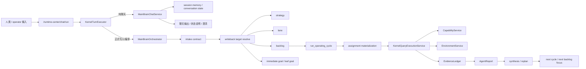

当前正式约束：

- 人类默认先进入主脑前门。
- `MainBrainChatService` 不再偷偷做 durable write。
- 正式写入统一经过 `MainBrainOrchestrator`。
- 正式主脑心智不是旧 `goal dispatch`，而是 `strategy -> lane -> backlog -> cycle -> assignment -> report -> replan`。

## 4. 行业自治主链

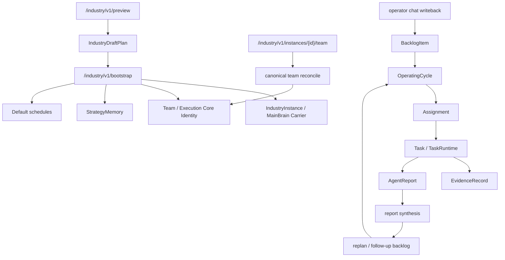

行业层当前承担 4 件核心事：

- 建立 carrier、team、execution-core identity
- 接受 operator 指令并落到 backlog/cycle/assignment 主链
- 消化 report/evidence 并产出 replan/follow-up
- 给 Runtime Center 和 `/industry` 提供 focused runtime / planning / chain detail 读面

## 5. 团队创建、补位、晋升、退场链

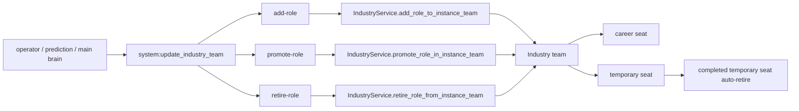

当前 seat 规则是正式模型：

- `employment_mode=career|temporary`
- `activation_mode=persistent|on-demand`

系统行为：

- 低风险本地缺口可自动补临时位
- 高风险/长期缺口先走治理提案
- 重复 add 同一长期岗位时优先复用
- `temporary -> career` 是晋升，不是新建第二个岗位
- 已完成临时位在无 live work 时允许自动退场

## 6. 执行、能力、环境、证据链

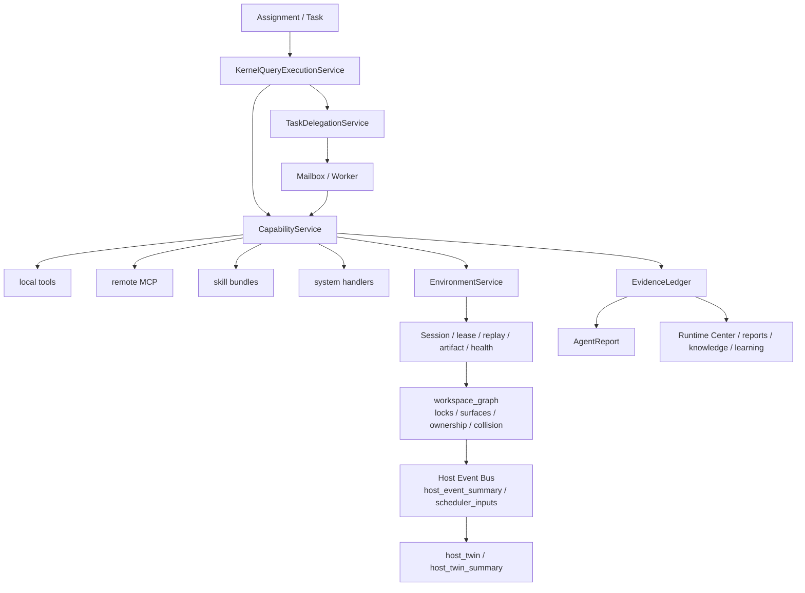

这里的正式边界是：

- `CapabilityService` 是统一执行入口
- `EnvironmentService` 是持续身体，不是每轮 prompt 恢复环境
- `EvidenceLedger` 是动作事实主链
- `Workspace Graph` 当前已经是结构化投影，不再只是 refs/count；它会派生 `locks / surfaces / ownership / collision / handoff_checkpoint / latest_host_event_summary`
- `Host Event Bus` 当前是正式 runtime mechanism，而不只是 detail payload；它会给恢复、handoff、scheduler 输入和 host blocker 判断供数
- execution-side 当前正式读链已经是 `workspace_graph -> host_event -> host_twin / host_twin_summary`
- canonical `host_twin / host_twin_summary` 当前不只给 workflow / fixed-sop 用，也会被 Runtime Center、task review、governance、workflow preview/run/resume、cron 共同消费
- `tool / MCP / skill` 仍有内部历史实现差异，但产品心智正在统一收口到 `CapabilityMount`

## 7. Host Twin、Human Assist、恢复链

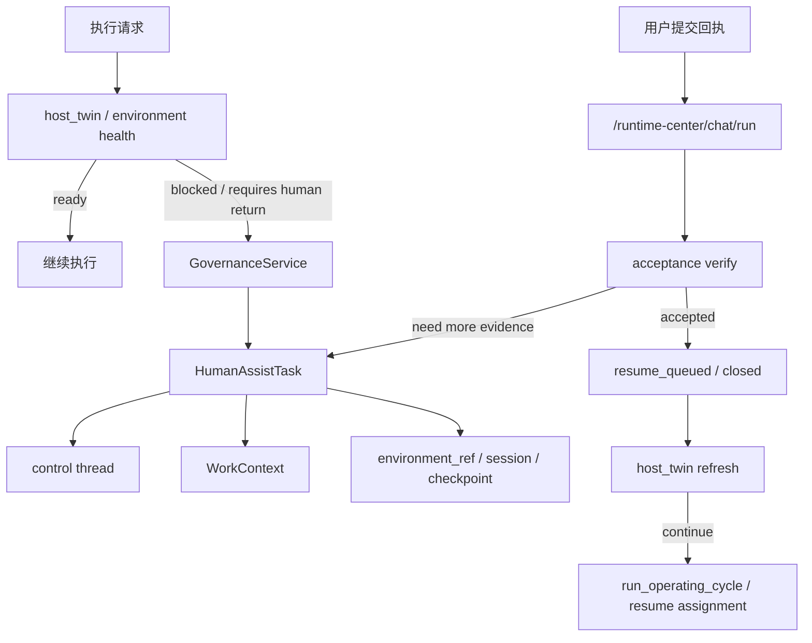

正式规则：

- `HumanAssistTask` 不是第二聊天系统
- 它是正式运行对象
- 它必须带验收契约、锚点、control thread、work context、environment continuity
- 恢复后继续接回原行业主链，不另起新线程

## 8. WorkContext 连续工作边界

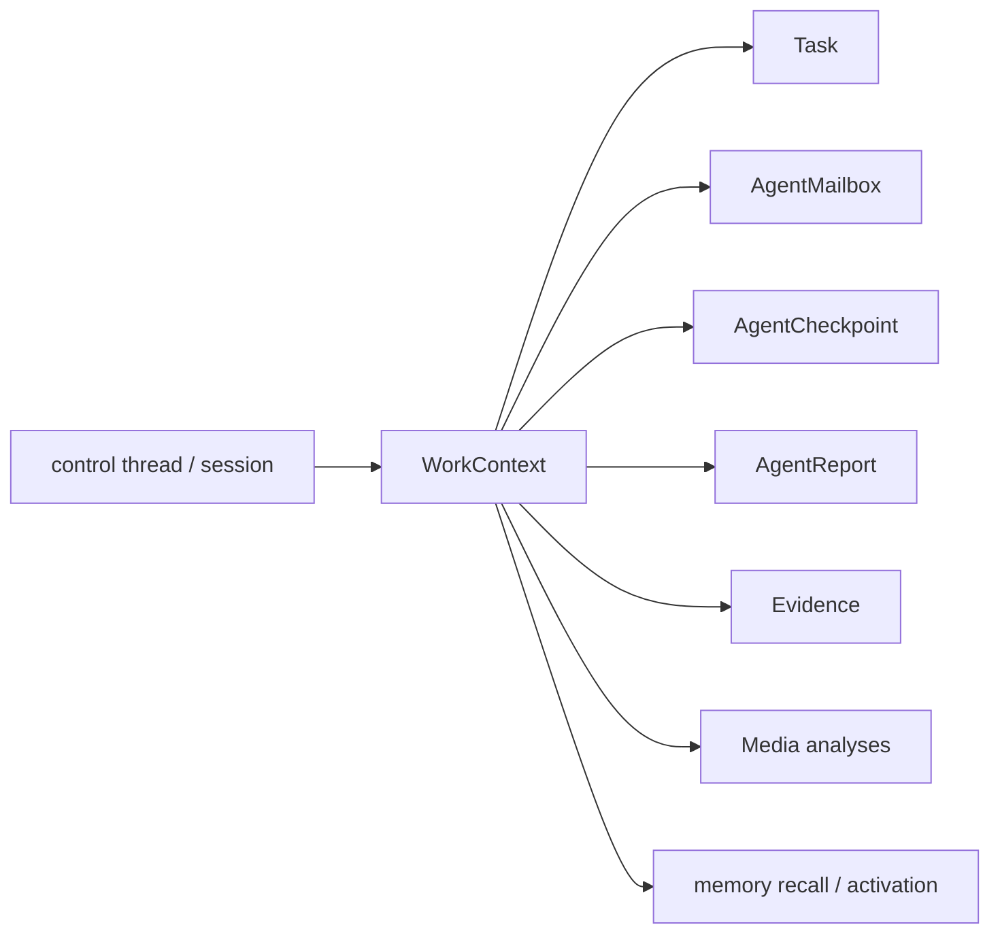

`WorkContext` 的定位：

- 它不是聊天线程别名
- 它不是某个 agent 的私有脑袋
- 它是“这件持续工作本身”的正式容器
- 它也是 media writeback、truth-first recall 与 activation scope 的连续性锚点之一

activation 当前也已进入正式派生链：

- `memory_activation_service` 会在 runtime bootstrap 时实例化并绑定到 `app.state`
- `KernelQueryExecutionService` prompt retrieval、`GoalService` compiler context、industry report synthesis、follow-up backlog materialization 都可消费 activation-derived items / refs / constraints
- `Runtime Center` 已提供 `/runtime-center/memory/activation` 正式读面，task list/detail 与 memory profile/episode 读面也可附带 activation payload 或摘要
- activation 是派生激活层，不是新的 memory truth，也不是独立 graph persistence

## 9. 自动循环与长期自治链

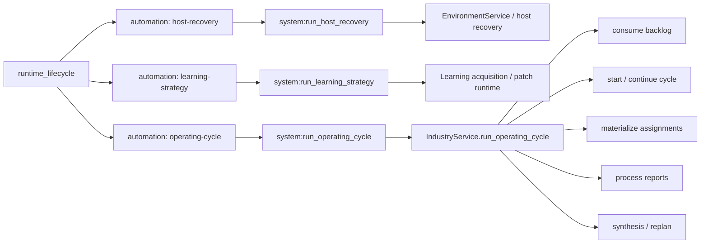

这就是当前“系统自己规划”的真实代码含义：

- 不是一个神秘后台人格随便决定
- `host-recovery` 是正式 execution/runtime 自动循环，会基于 host event 与 environment continuity 做恢复判定和继续执行
- `operating-cycle` 会定期判断是否要跑 `IndustryService.run_operating_cycle(...)`，然后消化 backlog、cycle、report、replan
- `learning-strategy` 会驱动 learning / acquisition / patch runtime，而不是只在文档里存在

## 10. workflow / fixed-sop / routines / cron / predictions 分支

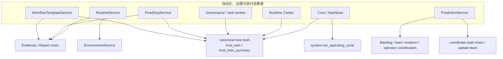

这些分支的定位：

- `workflow`：自动化模板与运行面，不是第二主脑
- `fixed-sop`：固定 SOP 内核，不是外包给外部 workflow 系统的第二真相源
- `routine`：叶子执行记忆与复用
- `cron/heartbeat`：触发器，不是独立 planning truth
- `predictions`：建议与协调桥，不再直接打底层执行

## 11. 学习、能力发现、安装绑定链

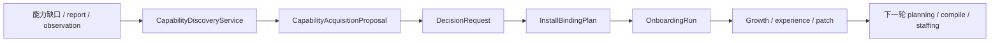

当前学习层不只做 patch：

- 也负责能力缺口发现
- 安装/绑定治理
- onboarding validate
- growth / experience 回流
- discovery 前门当前通过 `CapabilityService` 暴露；proposal / install-plan / onboarding-run 的持久化与运行则落在 learning acquisition runtime

## 12. Runtime Center 读面总览

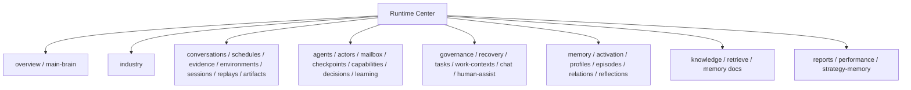

现役心智：

- Runtime Center 是总驾驶舱
- `/industry` 是 carrier 工作台
- `/chat` 是单主脑控制线程
- Agent Workbench 是职业执行位工作台
- `memory/activation` 已是 Runtime Center 的正式派生读面，不代表新增第二套 memory truth

## 13. 正式一等对象清单

当前应该按一等对象理解的核心对象：

- `IndustryInstance`
- `IndustryExecutionCoreIdentity`
- `StrategyMemory`
- `OperatingLane`
- `BacklogItem`
- `OperatingCycle`
- `Assignment`
- `Goal`（仅周期叶子对象）
- `Task`
- `TaskRuntime`
- `HumanAssistTask`
- `WorkContext`
- `EnvironmentMount`
- `SessionMount`
- `EvidenceRecord`
- `DecisionRequest`
- `AgentReport`
- `Patch / Proposal / Growth`
- `WorkflowRun / RoutineRun / FixedSopRun`

## 14. 已退役路径现状表

| 退役项 | 当前对外状态 | 仓库内是否还有残留 | 当前结论 |
|---|---|---|---|
| 旧 `/runtime-center/chat/intake` | 已从公开路由删除，访问应为 `404` | 文档、测试与删旧护栏仍在 | 正式入口已物理删除 |
| 旧 `/runtime-center/chat/orchestrate` | 已从公开路由删除，访问应为 `404` | 测试护栏仍在 | 正式入口已物理删除 |
| 旧 `/runtime-center/tasks/{task_id}/delegate` | 已从公开路由删除，访问应为 `404` | 内核 `delegation_service` 仍在 | 前台入口已删，内部委派能力保留 |
| 旧 `/runtime-center/goals/{goal_id}` alias | 已从 assembled root-router 删除，访问应为 `404` | 叶子 goal detail 仍保留在 `/goals/{goal_id}/detail` | runtime-center alias 已退役 |
| 旧 goal dispatch frontdoor | `/goals/{id}/dispatch`、`/goals/automation/dispatch-active`、`/runtime-center/goals/{id}/dispatch` 已删 | `goals/service_dispatch.py` 仍保留叶子 dispatch family | 旧公共前门已删，执行层叶子 dispatch 仍保留 |
| `task-chat:*` | 前台会话拒绝，返回 `400` | 测试和拒绝护栏仍在 | 产品心智已退役 |
| `actor-chat:*` | 前台会话拒绝，返回 `400` | 仍有 binding 清理逻辑和拒绝分支 | 产品心智已退役，删旧护栏未完全归零 |
| 人类直连 capability direct execute | 公开 execute 路由已删 | 文档/测试里仍有 retired 说明 | 正式产品入口已删 |
| 旧 `query_confirmation_policy` | 不再是现役治理能力 | 仅剩“确认已删除”的测试护栏 | 已退役 |

## 15. 关于“删没删干净”的准确判断

这批退役项不能简单说成“全部彻底删光”。更准确地说：

### 15.1 已经删掉的部分

- 正式公开路由
- 前台产品心智
- OpenAPI 暴露面
- 主脑 prompt / capability surface 中的大部分旧公共名

### 15.2 还会残留的部分

- 删除后的 `404/400` 护栏测试
- 对旧 thread id 的拒绝分支
- 对旧 binding 的清理逻辑
- 执行层内部叶子 dispatch family
- prediction 启动期对 retired recommendation 的清洗逻辑

### 15.3 当前最准确结论

- “正式产品前门”层面，已退役路径大多已物理删除。
- “仓库源码完全零残留”层面，还没有做到。
- 当前仍存在少量兼容清理、错误提示、测试护栏和叶子执行边界残留。

## 16. 一句话结论

当前现役 CoPaw 不是“聊天机器人 + 工具集合”，而是：

`多入口接入 -> 单主脑前门 -> 单执行内核 -> 单正式真相链 -> Decision / HumanAssist 治理旁路 -> Evidence / Report / Learning / Host Twin 回流 -> Runtime Center 可见化 -> 下一轮 operating cycle`
