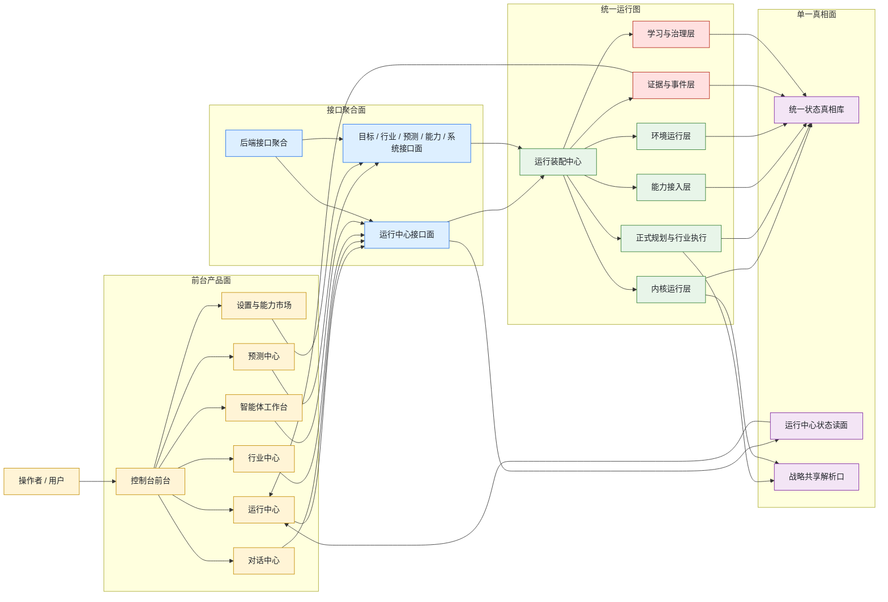
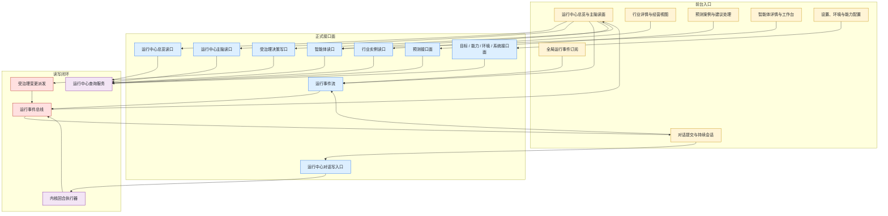
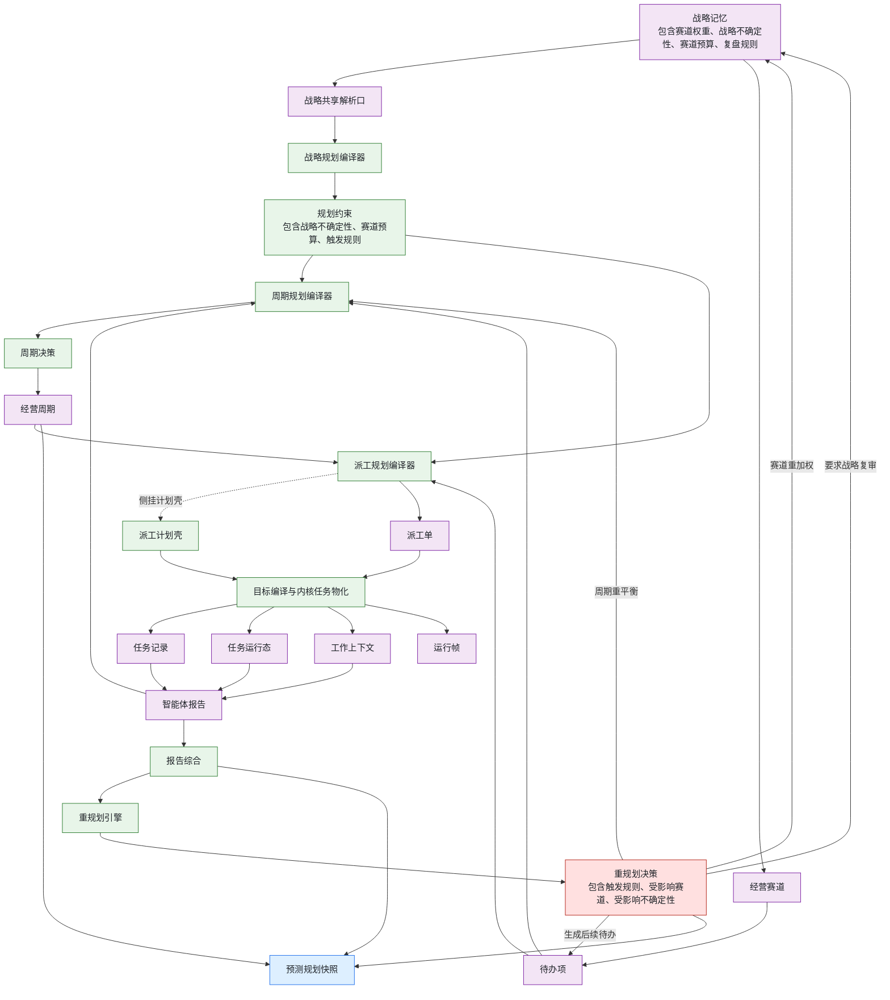
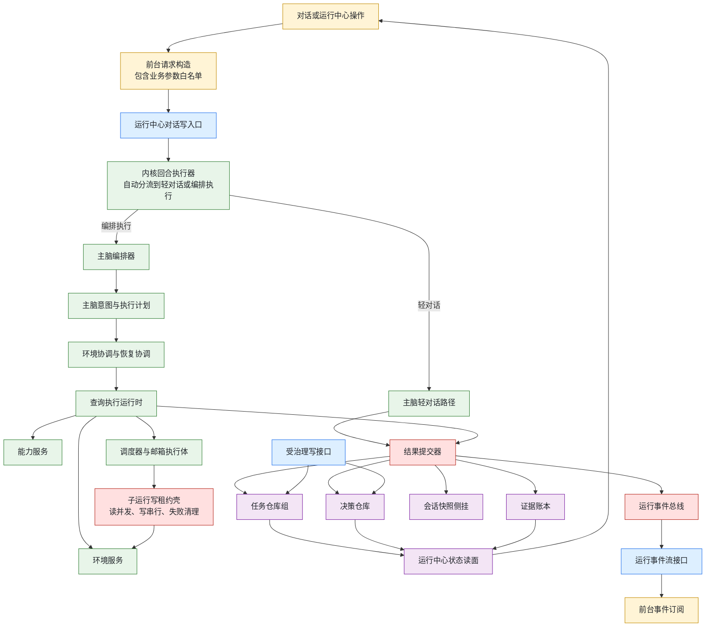
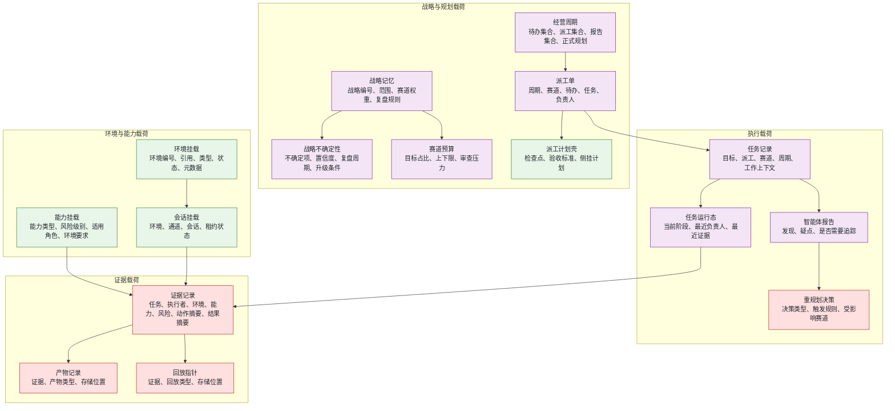
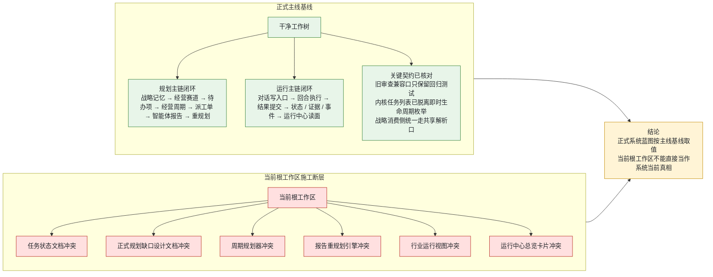

# 当前系统构建蓝图

> 基线：已合并主线架构  
> 审计叠层：当前根工作区存在并行施工冲突，单独标注，不计入正式主线蓝图

> `2026-04-03` 补充：`/runtime-center/main-brain` 现在已经把 `main_brain_planning` 提升成 dedicated read contract；Runtime Center 主脑 cockpit 不再只借道 `report_cognition.replan` 或 `current_cycle.main_brain_planning`，而是直接消费同名 planning surface，展示 `strategy_constraints / latest_cycle_decision / focused_assignment_plan / replan` 四段正式规划壳。

## 总蓝图

## 产品入口与接口挂载

## 正式对象主链与规划闭环

## 运行与执行闭环

## 环境、能力、证据、数据关系

## 审计叠层：当前断层与闭环状态

