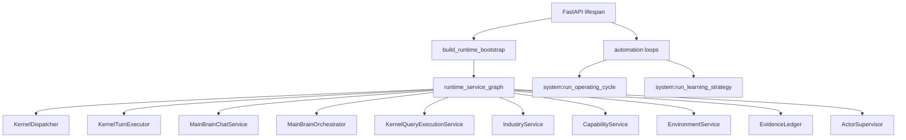
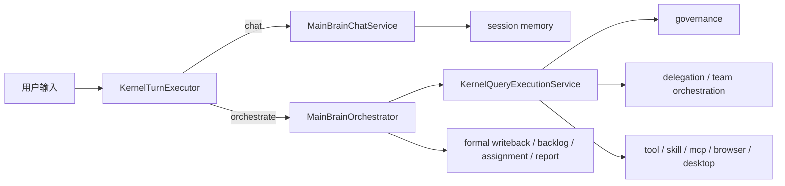
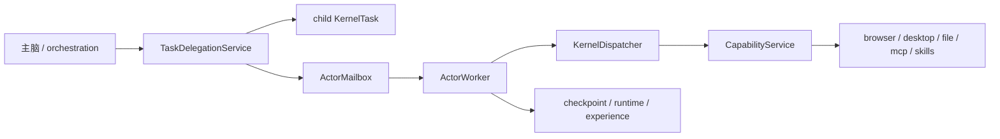
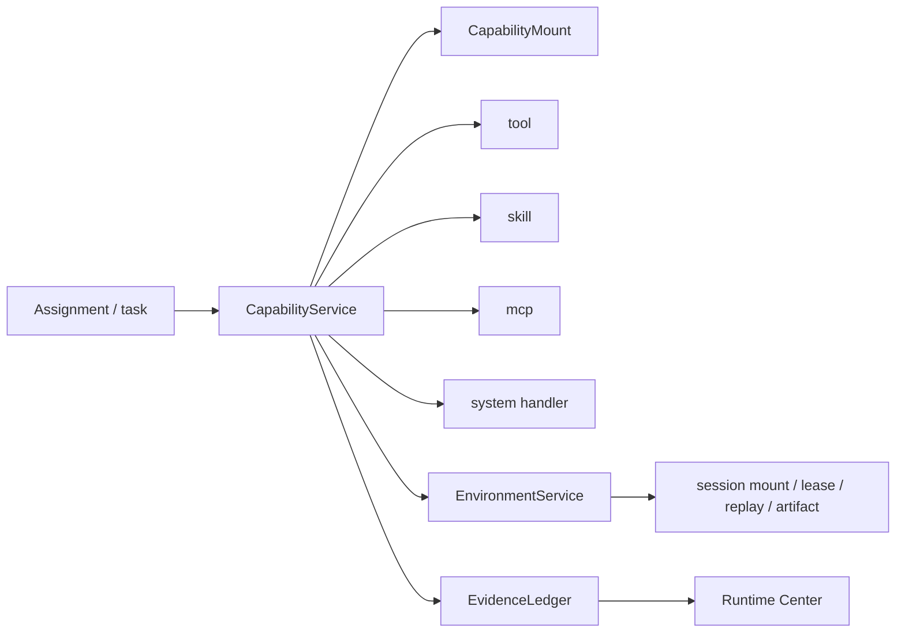
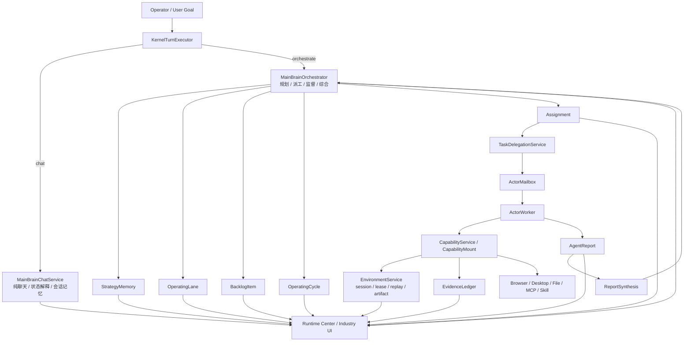

# CoPaw 全仓架构地图与一次性断代重构设计稿

## 1. 目标

本设计稿用于把当前 `CoPaw` 从“多主线并存、平台能力很强但主脑边界不够硬”的状态，收口为：

- 单一长期自治主链
- 单一主脑执行入口
- 单一能力语义
- 单一环境/证据主链
- 单一前端运行心智

本次不是“继续兼容演进”，而是：

- 允许短期停机
- 接受前后端断代切换
- 接受旧数据直接删除
- 接受旧 `goal/task/schedule` 主线直接退役

因此本次重构采用：

- `硬切主链`
- `清库`
- `删旧入口`
- `不做长期兼容`

## 2. 已确认边界

本轮设计已确认以下边界：

- 接受一次性大重构同时推进
- 接受一个短期停机 / 功能不完整窗口
- 接受旧 `goal/task/schedule` 退出主脑主线
- 接受旧前端 / 旧 API 一起下线
- 接受当前系统尚未正式应用，历史数据可直接删除

这意味着本次不再以“迁移历史数据”为主要约束，而以“切掉旧真相源、切掉旧主链”为最高约束。

## 3. 当前真实架构地图

本节描述的是当前仓库中已经真实存在的主链，不是规划图。

### 3.1 组合根与启动主链

当前真实组合根位于：

- `src/copaw/app/runtime_service_graph.py`
- `src/copaw/app/_app.py`
- `src/copaw/app/runtime_lifecycle.py`

当前启动时会真实装配和拉起：

- state repositories
- environment service
- evidence ledger
- runtime event bus
- goal service
- agent profile service
- reporting service
- industry service
- workflow / SOP / routine / prediction service
- delegation service
- query execution service
- main brain chat service
- actor supervisor
- automation loops

### 3.2 当前运行时主链



### 3.3 当前对话 / 编排分流



当前这里的真实问题是：

- `chat` 与 `orchestrate` 已经分开
- `MainBrainChatService` 已退回纯聊天 / 状态解释 / 会话记忆，不再后台触发正式 `writeback/kickoff`
- durable operator execution 已统一经 `MainBrainOrchestrator -> KernelQueryExecutionService` 进入正式编排链
- 当前剩余问题不再是聊天链偷写 runtime，而是旧 `goal/task/schedule` 叶子兼容边界尚未完全清零

### 3.4 当前状态链

当前仓库中同时存在两套重要心智：

#### 旧心智

- `GoalRecord`
- `TaskRecord`
- `ScheduleRecord`

#### 新心智

- `StrategyMemoryRecord`
- `OperatingLaneRecord`
- `BacklogItemRecord`
- `OperatingCycleRecord`
- `AssignmentRecord`
- `AgentReportRecord`
- `WorkContextRecord`

当前真实问题不是“新对象不存在”，而是：

- 新旧对象都存在
- 部分旧对象仍在承担主脑运行语义
- 新 backlog 仍会从旧 `goal/schedule` 物化

### 3.5 当前委派链



当前这里的真实情况是：

- 委派不是假的
- 它真的会生成 child task、mailbox、worker 执行
- 但它更像工单执行系统，不像高认知团队管理系统

### 3.6 当前能力 / 环境 / 证据链



当前这里的真实情况是：

- `CapabilityMount` 方向是对的
- 环境和证据是亮点
- 但内部仍残留 `tool/skill/mcp/system-handler` 多重历史语义

### 3.7 当前行业层与前端层

当前行业层主要集中在：

- `src/copaw/industry/service.py`
- `src/copaw/industry/service_context.py`
- `src/copaw/industry/service_lifecycle.py`
- `src/copaw/industry/service_team_runtime.py`
- `src/copaw/industry/service_strategy.py`
- `src/copaw/industry/service_runtime_views.py`

当前前端运行中心主要集中在：

- `console/src/pages/Industry/index.tsx`

当前这里的真实问题是：

- 行业层承担过多职责
- 前端页体量过大
- 新旧心智未完全收口

## 4. 当前结构性问题

本次重构不以“修小 bug”为目标，而以解决以下结构性问题为目标：

### 4.1 双主线并存

- old `goal/task/schedule`
- new `lane/backlog/cycle/assignment/report`

同时存在，导致：

- 主脑真相源不唯一
- 前端心智不唯一
- API 入口不唯一
- 迁移债务持续累积

### 4.2 主脑边界偏软

当前主脑“不亲自下场”的规则，仍较大程度依赖：

- prompt
- governance 文本约束
- 运行时策略约束

而不是完全依赖硬架构。

### 4.3 子 agent 更像 worker，不像专家协作者

当前子 agent 主要是：

- 通用 ReActAgent 内核
- 角色包装
- 工具 / skill / MCP 挂载
- 权限边界

它们会做事，但不是天然的高认知专家执行体。

### 4.4 路由仍残留关键词和写死应用名味道

旧 `service_context.py` token tables 已经从主逻辑移除。

当前残留的启发式只作为 fallback 信号存在于 chat writeback target matching 边界，
主判据已经收口为：

- `CapabilityMount`
- `environment constraints`
- `surface`

也就是说，像“文末天机”这类未知应用现在优先按 desktop/browser 面路由，
不再依赖写死 app 名关键词。

### 4.5 行业层 / 前端层过重

- `IndustryService` 是 mixin 拼出来的大壳子
- `KernelQueryExecutionService` 也是 mixin 壳
- `console/src/pages/Industry/index.tsx` 承载过重

这会导致：

- 认知负担高
- 维护成本高
- 删除旧逻辑难

### 4.6 产品表象与真实主链不一致

例如：

- 运行中心的 `/tasks/{task_id}/delegate` 已物理删除
- `/industry`、`Runtime Center`、`AgentWorkbench` 已统一消费 shared control-chain presenter

当前剩余的不一致更多是历史文档和少量 leaf compatibility，而不是前台仍暴露旧 delegate 产品入口。

## 5. 目标架构总图

本次重构完成后，系统应只剩一条正式主链：



## 6. 最终对象边界

### 6.1 正式一等对象

本次重构完成后，正式一等对象只保留：

- `StrategyMemoryRecord`
- `OperatingLaneRecord`
- `BacklogItemRecord`
- `OperatingCycleRecord`
- `AssignmentRecord`
- `AgentReportRecord`
- `WorkContextRecord`
- `CapabilityMount`
- `EnvironmentMount`
- `SessionMount`
- `EvidenceRecord`

### 6.2 旧对象的新定位

`TaskRecord`

- 保留
- 仅作为底层内核执行记录
- 不再承担主脑规划对象语义

`ScheduleRecord`

- 保留
- 仅作为 automation / routine / cron 记录
- 不再承担主脑长期计划对象语义

`GoalRecord`

- 退出主脑主线
- 不再由 operator 入口默认生成
- 不再驱动行业长期执行
- 如果重构完成后无刚性底层用途，直接删除

### 6.3 行业长期执行的正式承载链

行业长期执行不是删除，而是替代为正式新链：

```text
StrategyMemory
-> OperatingLane
-> BacklogItem
-> OperatingCycle
-> Assignment
-> AgentReport
-> Synthesis / Replan
```

## 7. 主脑层与委派层最终边界

### 7.1 主脑层只负责 6 件事

主脑只负责：

1. 接收目标
2. 更新长期战略与边界
3. 把工作编译进 `lane/backlog/cycle`
4. 生成和下发 `assignment`
5. 收集 `agent report` 并做 `synthesis`
6. 决定 `replan / 新派工 / 结束汇报`

主脑明确不负责：

- 直接做叶子执行
- 自己调用 browser / desktop / file 去完成一线动作
- 自己伪装成临时工
- 直接把用户一句话变成一堆活跃 task

### 7.2 主脑服务拆分

`KernelTurnExecutor`

- 只负责决定 `chat` 还是 `orchestrate`

`MainBrainChatService`

- 退回纯聊天服务
- 仅负责状态解释、讨论、会话记忆
- 不再后台触发 `writeback/kickoff`

`MainBrainOrchestrator`

- 成为唯一正式主脑执行入口
- 接收 operator turn
- 写战略
- 管理 backlog
- 选择或启动 cycle
- 下发 assignment
- 收 report
- 做 synthesis
- 决定 replan

### 7.3 委派层定位

`TaskDelegationService` 只负责：

- 校验目标执行位
- 校验能力 / 环境 / 治理
- 生成 child task / mailbox item
- 维护派工状态
- 回传调度结果

它不再承担：

- 战略判断
- 结果综合
- 主管式思考

### 7.4 执行位定位

`ActorWorker` 与职业 agent 只负责：

- 接 `assignment`
- 在边界内执行
- 产出结构化 `report`
- 升级上报阻塞 / 不确定项

它们不负责：

- 改战略
- 改主线对象模型
- 代替主脑做最终结论

### 7.5 临时工规则

保持已确认规则：

- 长期重复性 lane work -> 新增长期岗位
- 一次性、低风险、局部执行 -> 创建临时工
- 主脑永远不转成叶子执行位

说明：

- 这条规则吸收并覆盖了早期 `seat-gap closure` 专项计划。
- 旧 `2026-03-23-seat-gap-closure.md` 现在只保留为 seat-gap/staffing 子问题的历史实施切片，不再与本设计稿平级。

## 8. 状态链硬切与旧主线退役

### 8.1 直接断代，不做历史迁移

由于系统尚未正式应用，本次直接采用：

- 清理旧状态数据
- 不迁移旧主线历史数据
- 不保留长期兼容读层

### 8.2 必删旧逻辑

本次必须直接删除：

1. 新 backlog 从旧 `goal/schedule` 物化的逻辑
2. operator 指令默认先落 `goal` 再转新对象的逻辑
3. 把 `goal` 当作长期使命容器的逻辑
4. 新旧双写逻辑
5. 旧页面 / 旧 API 中以 `goal/task/schedule` 为主心智的入口

### 8.3 新的唯一正式写入路径

以后 operator turn 只能走：

```text
operator turn
-> strategy update
-> lane resolution
-> backlog append/update
-> cycle selection/start
-> assignment issue
-> task execution
-> agent report
-> synthesis
-> replan or done
```

不再允许：

```text
operator turn
-> goal create/update
-> task create
-> backlog sync
-> cycle sync
```

### 8.4 数据清库范围

本次应允许并明确清理以下运行数据：

- `state/phase1.sqlite3`
- `evidence/phase1.sqlite3`
- 与旧 `goal/task/schedule` 强绑定的临时状态
- 与旧主线强绑定的测试基线数据

如记忆索引、派生视图或 sidecar 缓存与旧主线耦合，也一并清理后重建。

## 9. 能力层、环境层、证据层统一收口

### 9.1 单一能力语义

上层只允许看到：

- `CapabilityMount`

底层来源可以是：

- tool
- skill
- MCP
- browser runtime
- desktop adapter
- system handler

但这些都只能作为实现来源，不再作为运行时正式语义。

### 9.2 新的能力执行链

```text
assignment
-> required_capabilities
-> capability resolution
-> environment requirement check
-> governance check
-> execution
-> evidence append
-> report back
```

### 9.3 路由优先级

以后 routing 优先级固定为：

1. `能力挂载`
2. `环境约束`
3. `surface 判定`
4. `fallback 启发式`

这意味着未知应用不再依赖写死应用名，而依赖：

- 它属于 `desktop` 还是 `browser`
- 当前是否已有对应 session / window / page
- 当前岗位是否已挂载对应能力

### 9.4 关键词表处理原则

当前 `service_context.py` 中的 surface token 表不应继续作为主逻辑。

处理原则：

- 主逻辑迁移到 `mount/env/surface` 判定
- token 表缩到单独 fallback 模块
- 错码文本常量直接清理

### 9.5 环境层继续升格

环境层不删，只升格为硬依赖。

长期任务必须正式持有：

- browser session
- desktop window/session handle
- file workspace view
- observation cache
- replay handle
- artifact store

不再允许关键环境事实只靠 prompt 恢复。

### 9.6 证据层继续保持强一等公民

每次真实外部动作都应正式记录：

- capability ref
- environment ref
- owner agent
- risk level
- result summary
- artifact / replay pointer

前端必须能看到：

- 这个 assignment 用了什么能力
- 在什么环境里执行
- 产出了什么证据
- 为什么 blocked / confirm / failed

## 10. 行业层重构目标

### 10.1 行业层收口职责

行业层重构后只保留 3 类职责：

1. 行业编译
2. 团队装配
3. 行业运行视图聚合

行业层不再承担：

- 主脑运行控制主链
- 平行状态推进
- 综合裁决主链

### 10.2 建议拆分方向

建议把当前大壳子收口到：

- `industry/compiler/`
- `industry/bootstrap/`
- `industry/teaming/`
- `industry/views/`

当前 `IndustryService + mixin` 结构不宜继续膨胀。

### 10.3 行业长期执行如何保留

行业差异未来主要体现在：

- 初始战略
- lane 划分
- 岗位蓝图
- 能力挂载建议
- KPI / 风险 / 边界

真正长期执行发生在统一自治主链内，而不是行业层自带另一条主线。

## 11. 前端层重构目标

### 11.1 前端一等对象

前端新的正式一等对象只保留：

- Strategy
- Lane
- Backlog
- Cycle
- Assignment
- Report
- Agent
- Environment
- Evidence
- Decision

### 11.2 新前端结构

建议至少拆成 4 个正式板块：

1. `Control / Strategy`
2. `Execution`
3. `Environment / Evidence`
4. `Team / Staffing`

### 11.3 必删前端遗留

本次应直接删除：

- 旧 `goal/task/schedule` 主视图
- 旧入口导向的兼容导航
- 只展示配置、不展示运行事实的旧页面

### 11.4 运行中心必须可见的事实

前端必须能直接展示：

- 当前战略
- 当前 cycle
- 当前 assignment
- 最新 report
- synthesis 结论
- replan 原因
- 当前环境
- 当前证据

## 12. 记忆层与学习层收口

### 12.1 记忆层定位

记忆层只保留 3 个用途：

1. 检索辅助
2. 战略沉淀
3. 执行经验回流

它不再承担“代替主脑思考”的隐式职责。

### 12.2 运行健康可视化

以下问题必须进入正式运行健康面板，而不是只留在日志里：

- `EMBEDDING_MODEL_NAME` 缺失
- vector search 降级
- QMD sidecar 不可用
- browser runtime 未就绪
- desktop actuation 未挂载

系统必须区分：

- 核心主链可运行
- 增强智能能力可运行
- 全能力可运行

### 12.3 学习层定位

学习层只做：

1. 发现瓶颈
2. 产出 proposal
3. 生成 patch / capability recommendation / staffing recommendation

学习层不允许：

- 偷偷改主脑运行态
- 越权改岗位
- 越权改长期战略

## 13. 删除清单

本次大重构的正式交付物必须包含删除项，而不只是新增项。

### 13.1 已完成删除/收口

- `MainBrainChatService` 后台 `writeback/kickoff` 逻辑
- `service_context.py` 中主逻辑依赖的写死 surface token 路由
- runtime-center direct delegate 入口
- 前台公开的旧 goal-dispatch / direct-execution 入口
- formal operating-cycle 里的 `goal -> task` 中转物化

### 13.2 仍待继续删除的叶子兼容

- `GoalRecord` 及其相关 repository / service / route / UI
- 旧前端查询模型
- 旧行业兼容视图
- 与旧 `goal/task/schedule` 强绑定的临时状态

如果新主线切完后这些对象仍无刚性用途，应直接删除而不是继续保留。

## 14. 一次性大重构的施工波次

虽然本次是一次性大重构，但内部仍应按 4 个波次施工：

### 波次 1：主脑主链切换

- 已引入正式 `MainBrainOrchestrator`
- `MainBrainChatService` 已退回纯 chat
- chat 后台 `writeback/kickoff` 已切掉
- operator turn 已正式进入 `strategy/lane/backlog/cycle/assignment/report`

### 波次 2：状态链断代

- 删除旧 `goal -> backlog` 物化
- 删除旧 `goal/schedule` 主脑主线
- 清库并重建新主线基线

### 波次 3：能力/环境/证据统一

- 收敛 `CapabilityMount`
- 把 routing 从 token 主导改为 `mount/env/surface`
- 收紧 environment/evidence 为执行主链硬依赖

### 波次 4：行业与前端断代

- 拆分行业层职责
- 删除旧前端心智
- 前端只展示新对象模型
- 增加运行健康 / 环境 / 证据可视化

## 15. 验收标准

本次重构完成时，至少要满足：

### 15.1 主脑主链

- operator 新指令不再默认生成 `GoalRecord`
- `chat` 不再后台写回 / kick off
- 主脑不再直接下场执行叶子动作
- 无岗位时只允许创建临时工或提案新长期岗位

### 15.2 状态主链

- 行业长期执行完全走 `strategy/lane/backlog/cycle/assignment/report`
- backlog 不再从旧 `goal/schedule` 物化
- 旧双写逻辑不存在

### 15.3 委派与执行

- assignment 一定能落到正式 worker 执行链
- report 一定能回流主脑
- synthesis 一定能驱动 replan 或 follow-up

### 15.4 能力与环境

- 未知应用可按 `desktop/browser` surface 路由
- routing 不再依赖写死应用名
- 环境状态和证据状态前端可见

### 15.5 前端

- Runtime Center / Industry 只展示新主线对象
- 用户可见完整监督链：
  - `writeback -> backlog -> cycle -> assignment -> report -> replan`

### 15.6 删除收口

- 旧主脑主线入口已下线
- 旧页面 / 旧 API 已下线
- 无长期兼容双真相源残留

## 16. 非目标

本次不以以下事项为目标：

- 保留旧历史数据
- 为旧接口长期兼容兜底
- 让子 agent 直接变成“第二个主脑”
- 再扩张新的平台功能面

本次的唯一目标是：

> 把 `CoPaw` 从“复杂但混合”的状态，切到“主链单一、边界清晰、可以继续自治演进”的状态。

## 17. 最终结论

本次不是“继续打补丁”，而是一次正式断代：

- 旧主线退役
- 新主线升格
- 主脑边界硬化
- 委派层收口为正式派工系统
- 能力层收口为 `CapabilityMount`
- 环境 / 证据升格为执行主链硬依赖
- 行业层退回编译 / 装配 / 视图
- 前端升级为真正运行中心

如果这次重构只新增不删除，最终一定继续积累为另一座更大的遗留系统。
